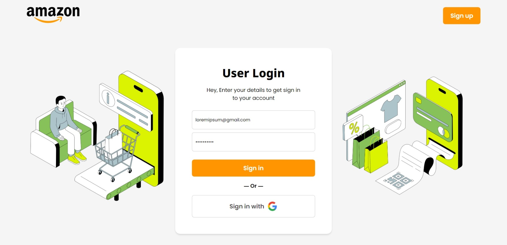
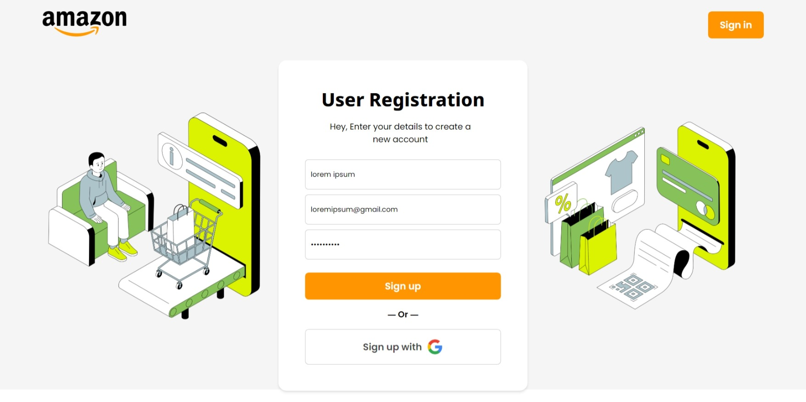

# Amazon Clone

This is a clone of Amazon web application, with improved UI and all major functionalities such as adding products to wishlist, browsing different product categories, adding products to cart, managing shipping details, and payment options. The project is responsive and can be used on any device.

# Technologies Used

ReactJS

Firebase Authentication

Firebase Firestore

FakeStore API


# Features

Improved UI than the original Amazon web application

User can add products to wishlist

User can browse products based on different categories

User can add products to cart

User can manage shipping details

User can make payment for the products

User profile tab for managing personal information


# Installation and Setup


1.Clone the repository

2.Navigate to the project directory and `run npm install` to install all the dependencies

3.Create a Firebase account and enable Firebase Authentication and Firestore

4.Create a new Firebase project and copy the configuration details to src/Firebase.js

5.Open `.firebaserc` and modify this line:
    ```sh
    "projects": {
        "default": "firebaseProjectId", //replace with your firebase project id
        "staging": "firebaseProjectId" //replace with your firebase project id
    },
    ```

Run `npm start` to start the application


# Screenshots

**Authentication page**

<div>
  
</div>

<div>
  
</div>


**Home page**

<div>
  
</div>

<div>
  
</div>


**Wishlist page**

<div>
  
</div>


**Product page**

<div>
  
</div>


**Cart page**

<div>
  
</div>


**Payment page**

<div>
  
</div>

<div>
  
</div>

<div>
  
</div>


**Orders page**

<div>
  
</div>


**Profile page**

<div>
  
</div>


# Contributing


Contributions to this project are always welcome. Please feel free to raise an issue or submit a pull request if you find any bug or have any feature requests.
